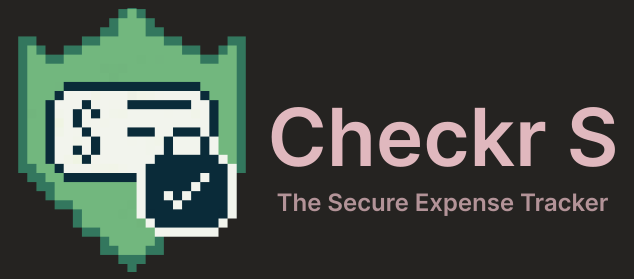

# 

# About the App
Checkr S is a secure and intuitive web application that is designed to allow users to track monthly transactions with ease.
This project aims to provide more than just a basic CRUD application by digging deeper and ensuring best security practices.
Built primarily with Flask, the app features strong authentication, session security, CSRF protection, rate limiting, and a clean user interface.

# Features
- **Secure User Authentication**
    - Username and Password validation with Flask-WTF and Regepx to force strong inputs
    - Flask-Login for secure session handling
    - Configured Session Lifetime to ensure users are logged out after 30 minutes of inactivity
- **Month and Year Selection**
    - Users can choose a specific year to log transactions in
        - Selections go from the year 2000 to whatever the current year is (future proof)
    - Users can choose a specific month to log transactions in to maintain an organized checkbook
- **Starting Balance Tracker**
    - Users a required to enter a starting balance for each month before they can begin entering transactions
    - This helps users keep track of their total balance just like a real checkbook does
    - After setting a starting balance for a given month, the amount is then updated each time a user creates, edits, or deletes a transaction
    and is marked as 'this months balance'.
- **Transaction Management**
    - Users can create, edit, and delete transactions
    - Transactions have fields for type (deposit or withdrawal), date, description, and amount
- **Rate Limiting**
    - This app manages rate limiting using Flask-Limiter and Redis hosted on Upstash to store rate limit data in-memory
    - The addition of rate limiting helps protect the login route from brute-force attacks by limiting the number of requests an individual ip address can make at a time before getting locked for 5 minutes
- **Error Logging**
    - Additionally, this app uses pythons logging module to log errors server-side to the console on Render (stdout)
    - This ensures that users dont obtain access to sensitive information from any potential errors and that errors are logged so they can be fixed
    - (if running the application locally, see the comments on lines 22 & 46 in `__init__.py` to log errors to a .log file using a RotatingFileHandler)

# Tech Stack
- **Core Technologies:**
    - Flask
    - HTML
    - SCSS
- **Flask Extensions:**
    - Flask-SQLAlchemy (ORM to create database models written in python)
    - Flask-WTF (create secure HTML form with CSRF protection)
    - Flask-Login (handle authentication logic)
    - Flask-Limiter (handle rate limiting to prevent brute force attacks)
- **Databases:**
    - PostgreSQL hosted on Supabase (stores all user, transaction, and balance data)
    - Redis hosted on Upstash (used for storing rate limiting data which is constantly being updated)

# Project Structure
```bash
├── README.md
├── app/
│   ├── __init__.py
│   ├── auth.py
│   ├── forms.py
│   ├── models.py
│   ├── routes.py
│   ├── static/
│   │   ├── images
│   │   │   ├── app-logo.PNG
│   │   │   └── banner.svg
│   │   ├── styles.css
│   │   ├── styles.css.map
│   │   └── styles.scss
│   └── templates/
│       ├── auth/
│       │   ├── login.html
│       │   └── register.html
│       ├── base.html
│       └── main/
│           ├── checkbook.html
│           ├── dashboard.html
│           └── edit.html
├── main.py
└── requirements.txt
```

7 directories, 19 files


# Deployment

# Run the Project Locally
```
#mac
python3 -m venv env
#windows
python -m venv env
```

# What I Learned

